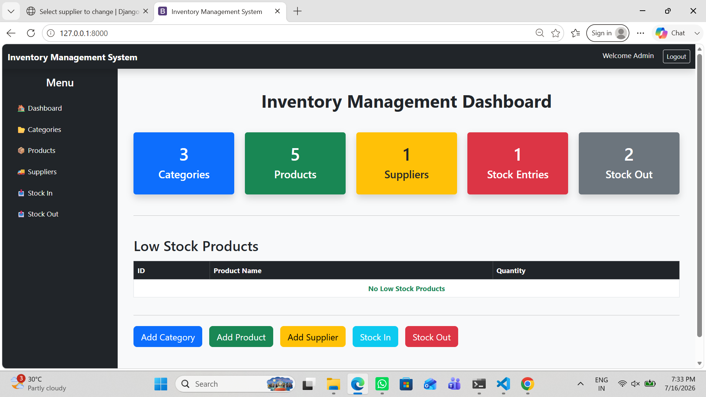
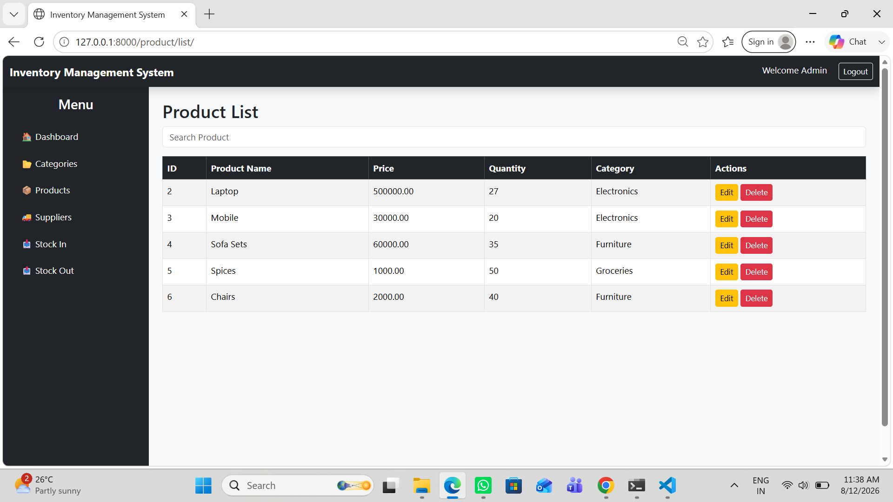
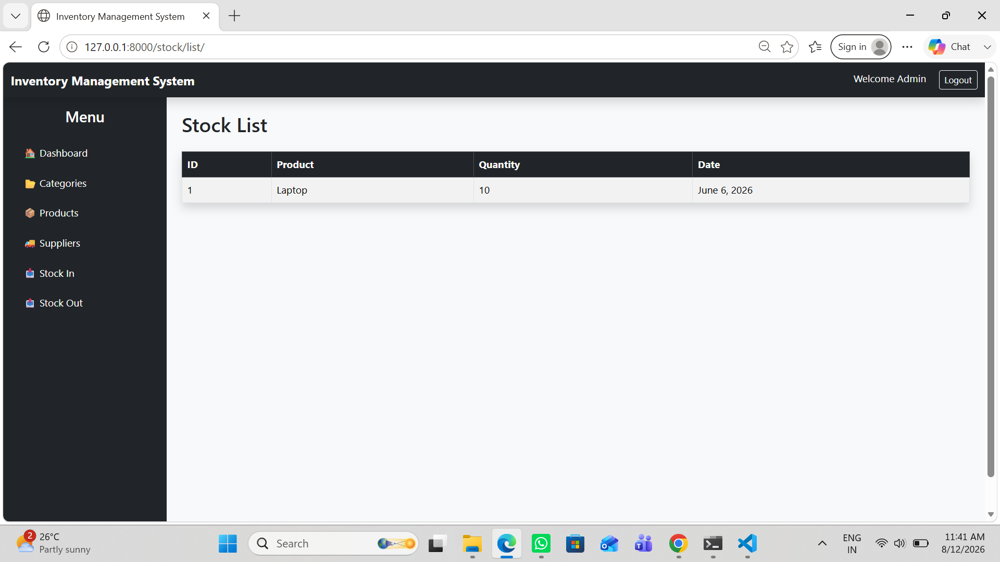
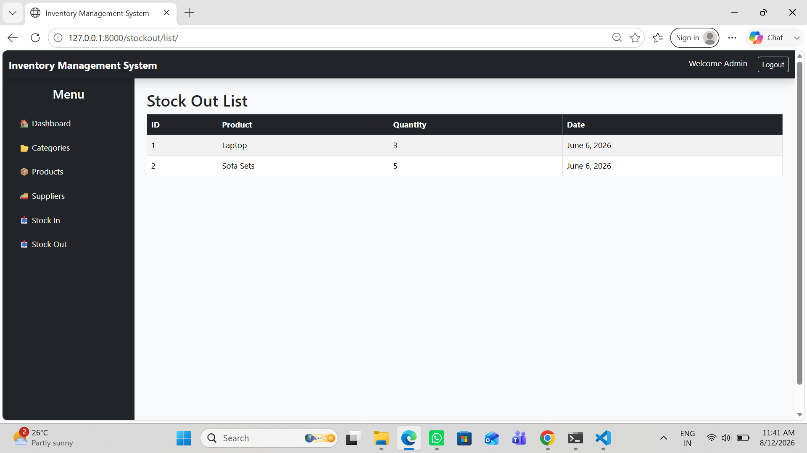
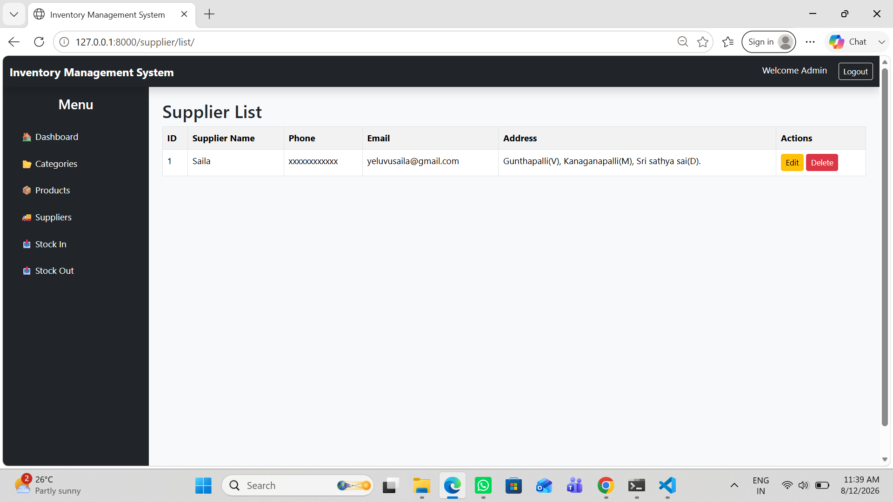

# Inventory Management System

## Project Description
A web-based Inventory Management System developed using Django and Python.
It helps manage products, categories, suppliers, stock and inventory details efficiently.

## Technologies Used
- Python
- Django
- HTML
- CSS
- Bootstrap
- SQLite 

## Features
- User-friendly dashboard
- Product management
- Category management
- Supplier management
- Stock management
- Stock-out product tracking
- Add, update and delete products

## How to Run the Project

1. Clone the repository
2. Create a virtual environment
3. Install required packages
4. Run database migrations
5. Start the Django development server

## Project Structure
The project contains Django apps, templates, static files and database configuration.

## Author
Yeluvu Saila

## Screenshots

### Dashboard

### Products

### Stock In

### Stock Out

### Suppliers

